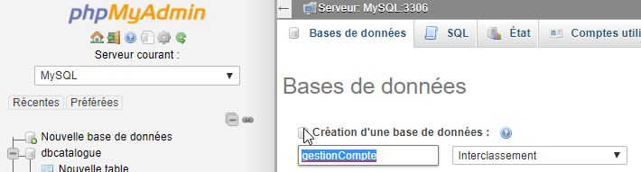

# Mise oeuvre d'un serveur


## Projet

### Creation d'un base de données 

Crééer une base de données mysql au nom **gestionCompte**. Sans rien configuré. Ni l'instance ni l'utilisateur. Le compte utilisé sera root en localhost


    
### creation d'un  Spring stater Projet


Dependances  


application properties.

Pour permetttre de voir les associations ( foreign key) entre les tables il faut utiliser le dialect **MySQL5InnoDBDialect**.

```properties
spring.datasource.url = jdbc:mysql://localhost:3306/gestionCompte?useSSL=false&serverTimezone=UTC
spring.datasource.username = root
spring.datasource.password = password
spring.datasource.driver-class-name = com.mysql.cj.jdbc.Driver
spring.jpa.show-sql = true
spring.jpa.hibernate.ddl-auto = create
#spring.main.banner-mode = off
spring.jpa.properties.hibernate.dialect=org.hibernate.dialect.MySQL5InnoDBDialect
````

### Entités


il ne faut pas ajouter les attributs d'associations. manytoOne, OneTomany, manytomany .... dans les constructors.


dans ce projet nous employons la stratégie d'une **Single table strategie** pour les classes **Comptes** et **Operatoions** repectivement avec leurs classes d'heritage.


Dans les associations bidirectionnelles , de préférenc il faut  mettre "@JsonIgnore" aux getter renvoyant un type **Collection Object** pour eviter la recursivité lors d'appelle de methode http (get, ...)


Il faut préféré les association **manyToOne** pour rendre l'association bidirectionnel, que OntoMany. Ceci permet d'exclure les problemes de collections qui pourrait engendrée des problemes de recurisivité. Sinon il faut introduire l'annotation **@JsonIgnore** sur les attributs association dans la classe ayant ontoManu.


Entity **Client**
```java
package com.gestioncomptes.entities;

import java.io.Serializable;
import java.util.Collection;

import javax.persistence.Entity;
import javax.persistence.FetchType;
import javax.persistence.GeneratedValue;
import javax.persistence.GenerationType;
import javax.persistence.Id;
import javax.persistence.ManyToOne;
import javax.persistence.OneToMany;
import javax.xml.bind.annotation.XmlRootElement;
// for SOAP
import javax.xml.bind.annotation.XmlTransient;

// for restful
import com.fasterxml.jackson.annotation.JsonIgnore;

@Entity
@XmlRootElement
public class Client implements Serializable {

	@Id
	@GeneratedValue(strategy = GenerationType.IDENTITY)
	private Long codeClient;
	private String nomClient;

	// Un client peut avoir un ou plusieurs compte. Mais un compte appartient à un
	// seul client.
	@OneToMany(mappedBy = "client", fetch = FetchType.LAZY)
	private Collection<Compte> comptes;

	public Long getCodeClient() {
		return codeClient;
	}

	public void setCodeClient(Long codeClient) {
		this.codeClient = codeClient;
	}

	public String getNomClient() {
		return nomClient;
	}

	public void setNomClient(String nomClient) {
		this.nomClient = nomClient;
	}

	@JsonIgnore
	@XmlTransient
	public Collection<Compte> getComptes() {
		return comptes;
	}

	public void setComptes(Collection<Compte> comptes) {
		this.comptes = comptes;
	}

	public Client() {
		super();
		// TODO Auto-generated constructor stub
	}

	// Ne pas inclure les attributs d'association. "comptes"
	public Client(String nomClient) {
		super();
		this.nomClient = nomClient;
	}

}
```  

  
Entity **Compte**
```java
package com.gestioncomptes.entities;

import java.io.Serializable;
import java.util.Collection;
import java.util.Date;

import javax.persistence.DiscriminatorColumn;
import javax.persistence.DiscriminatorType;
import javax.persistence.Entity;
import javax.persistence.Id;
import javax.persistence.Inheritance;
import javax.persistence.InheritanceType;
import javax.persistence.JoinColumn;
import javax.persistence.ManyToOne;
import javax.persistence.OneToMany;
import javax.xml.bind.annotation.XmlRootElement;
import javax.xml.bind.annotation.XmlSeeAlso;
import javax.xml.bind.annotation.XmlTransient;

import com.fasterxml.jackson.annotation.JsonIgnore;
import com.fasterxml.jackson.annotation.JsonSubTypes;
import com.fasterxml.jackson.annotation.JsonSubTypes.Type;
import com.fasterxml.jackson.annotation.JsonTypeInfo;

@Entity

// classe d'heritage
@Inheritance(strategy = InheritanceType.SINGLE_TABLE)
@DiscriminatorColumn(name = "TYPE_COMPTE", discriminatorType = DiscriminatorType.STRING, length = 2) // length = 2 =>
																										// "CC"=compteCourant
																										// ,
																										// "CE"=compteEpargne
// Gestion du restful via Json
// La classe "Compte" est abstraite. Pour etre néanmoins instanciable depuis le resControler par l'api jackson durant
// la methode **post**. Nous devons specifier quelles sont les classes qui en heritent. Ici les Classes compteCourant
// et CompteEpargne herites de cette classes.Pour les distingués, on demande à json de regarder la proprietés "typeCompte"
// lors de la methode poste et affecte respectivement soit "CC" et "CE" pour les compteCourant et compteEparge.
@JsonTypeInfo(use = JsonTypeInfo.Id.NAME, include = JsonTypeInfo.As.PROPERTY, property = "typeCompteCCCR") // "typeCompteCCCR"
																											// => Ici
																											// defini//
																											// arbitrairement.

@JsonSubTypes({ @Type(name = "CC", value = CompteCourant.class), @Type(name = "CE", value = CompteEpargne.class) })
//Gestion de SOAP via xml ( equivalent à json )
@XmlSeeAlso({ CompteCourant.class, CompteEpargne.class })
public abstract class Compte implements Serializable {

	@Id
	private String codeCompte;

	private Date dateCreation;
	private double solde;

	// Un compte appartient à un seul client ( association bidirectonnel )
	@ManyToOne
	@JoinColumn(name = "CODE_CLIENT") // CODE_CLIENT = foreignkey
	private Client client;

	// Une compte est creer par un seul employe ( association bidrectionnel )
	@ManyToOne
	@JoinColumn(name = "CODE_EMPLOYE") // CODE_EMPLOYE = foreignkey
	private Employe employe;

	// Un compte peut subir plusieur operations ( association unidirectionnel )
	@OneToMany(mappedBy = "compte")
	private Collection<Operation> operations;

	public String getCodeCompte() {
		return codeCompte;
	}

	public void setCodeCompte(String codeCompte) {
		this.codeCompte = codeCompte;
	}

	public Date getDateCreation() {
		return dateCreation;
	}

	public void setDateCreation(Date dateCreation) {
		this.dateCreation = dateCreation;
	}

	public double getSolde() {
		return solde;
	}

	public void setSolde(double solde) {
		this.solde = solde;
	}

	public Client getClient() {
		return client;
	}

	public void setClient(Client client) {
		this.client = client;
	}

	public Employe getEmploye() {
		return employe;
	}

	public void setEmploye(Employe employe) {
		this.employe = employe;
	}

	@JsonIgnore
	@XmlTransient
	public Collection<Operation> getOperations() {
		return operations;
	}

	public void setOperations(Collection<Operation> operations) {
		this.operations = operations;
	}

	// Ne pas inclure les attributs d'association. "client","employe","operations"
	public Compte(String codeCompte, Date dateCreation, double solde) {
		super();
		this.codeCompte = codeCompte;
		this.dateCreation = dateCreation;
		this.solde = solde;
	}

	public Compte() {
		super();
		// TODO Auto-generated constructor stub
	}

}

```


Entity **CompteCourant** qui hérite de  **Compte**.

````java
package com.gestioncomptes.entities;

import java.io.Serializable;
import java.util.Date;

import javax.persistence.DiscriminatorColumn;
import javax.persistence.DiscriminatorValue;
import javax.persistence.Entity;
import javax.xml.bind.annotation.XmlType;

@Entity
@DiscriminatorValue("CC") // CC = "compte Courant" annotation for json rest

@XmlType(name = "CC") // annotation for soap

public class CompteCourant extends Compte implements Serializable {

	private double decouvert;

	public CompteCourant() {
		super();
		// TODO Auto-generated constructor stub
	}

	public CompteCourant(String codeCompte, Date dateCreation, double solde, double decouvert) {
		super(codeCompte, dateCreation, solde);
		this.decouvert = decouvert;
	}

	public double getDecouvert() {
		return decouvert;
	}

	public void setDecouvert(double decouvert) {
		this.decouvert = decouvert;
	}

}
````


Entity **CompteEpargne** qui hérite de  **Compte**.

```java
package com.gestioncomptes.entities;

import java.io.Serializable;
import java.util.Date;

import javax.persistence.DiscriminatorValue;
import javax.persistence.Entity;
import javax.xml.bind.annotation.XmlType;

@Entity
@DiscriminatorValue("CE") // CE = compte epargne

@XmlType(name = "CE") // annotation for soap
public class CompteEpargne extends Compte implements Serializable {

	private double taux;

	public CompteEpargne(String codeCompte, Date dateCreation, double solde) {
		super(codeCompte, dateCreation, solde);
		// TODO Auto-generated constructor stub
	}

	public CompteEpargne() {
		super();
		// TODO Auto-generated constructor stub
	}

	public double getTaux() {
		return taux;
	}

	public void setTaux(double taux) {
		this.taux = taux;
	}

}
```

Entity **Employe**

```java
package com.gestioncomptes.entities;

import java.io.Serializable;
import java.util.Collection;

import javax.persistence.DiscriminatorValue;
import javax.persistence.Entity;
import javax.persistence.GeneratedValue;
import javax.persistence.GenerationType;
import javax.persistence.Id;
import javax.persistence.JoinColumn;
import javax.persistence.JoinTable;
import javax.persistence.ManyToMany;
import javax.persistence.ManyToOne;
import javax.persistence.OneToMany;
import javax.xml.bind.annotation.XmlSeeAlso;
import javax.xml.bind.annotation.XmlTransient;

import com.fasterxml.jackson.annotation.JsonIgnore;
import com.fasterxml.jackson.annotation.JsonSetter;

@Entity
public class Employe implements Serializable {

	@Id
	@GeneratedValue(strategy = GenerationType.IDENTITY)
	private Long codeEmploye;
	private String nomEmploye;

	// Association reflexive
	// 1 employé à 0 ou 1 chef superieur
	@ManyToOne
	@JoinColumn(name = "CODE_EMPLOYE_SUPERIEUR")
	private Employe employeSuperieur;

	@ManyToMany
	@JoinTable(name = "EMPOYE_GROUPE") // table de joindre
	private Collection<Groupe> groupes;

	// Ne pas inclure les attributs d'association. "employeSuperieur","groupes"
	public Employe(String nomEmploye) {
		super();
		this.nomEmploye = nomEmploye;
	}

	public Employe() {
		super();
		// TODO Auto-generated constructor stub
	}

	public Long getCodeEmploye() {
		return codeEmploye;
	}

	public void setCodeEmploye(Long codeEmploye) {
		this.codeEmploye = codeEmploye;
	}

	public String getNomEmploye() {
		return nomEmploye;
	}

	public void setNomEmploye(String nomEmploye) {
		this.nomEmploye = nomEmploye;
	}

	@JsonIgnore // ne renvoi pas le résultat aux request get ...
	@XmlTransient
	public Employe getEmployeSuperieur() {
		return employeSuperieur;
	}

	@JsonSetter // autorise les updates depuis les request post sous form json
	public void setEmployeSuperieur(Employe employeSuperieur) {
		this.employeSuperieur = employeSuperieur;
	}

	@JsonIgnore
	@XmlTransient
	public Collection<Groupe> getGroupes() {
		return groupes;
	}

	@JsonSetter // autorise les updates depuis les request post sous form json
	public void setGroupes(Collection<Groupe> groupes) {
		this.groupes = groupes;
	}

}
```


Entity ****
```java
package com.gestioncomptes.entities;

import java.io.Serializable;
import java.util.Collection;

import javax.persistence.Entity;
import javax.persistence.GeneratedValue;
import javax.persistence.GenerationType;
import javax.persistence.Id;
import javax.persistence.ManyToMany;
import javax.persistence.Table;


@Entity
@Table(name="GROUPES")   // renommer la table Groupe en "groupes"
public class Groupe implements Serializable{

	@Id @GeneratedValue(strategy = GenerationType.IDENTITY)
	private Long codeGroupe;
	private String nomGroupe;
	
	@ManyToMany(mappedBy = "groupes")
	private  Collection<Employe> employes ;
	
	
	public Long getCodeGroupe() {
		return codeGroupe;
	}
	public void setCodeGroupe(Long codeGroupe) {
		this.codeGroupe = codeGroupe;
	}
	public String getNomGroupe() {
		return nomGroupe;
	}
	public void setNomGroupe(String nomGroupe) {
		this.nomGroupe = nomGroupe;
	}
	public Collection<Employe> getEmployes() {
		return employes;
	}
	public void setEmployes(Collection<Employe> employes) {
		this.employes = employes;
	}
	public Groupe() {
		super();
		// TODO Auto-generated constructor stub
	}
	
	// Ne pas inclure les attribut d'association. "employes"
	public Groupe(String nomGroupe) {
		super();
		this.nomGroupe = nomGroupe;
	}
		
}
```

Entity **Operation**  

Cette classe est abstraite

```java
package com.gestioncomptes.entities;

import java.io.Serializable;
import java.util.Date;

import javax.persistence.DiscriminatorColumn;
import javax.persistence.Entity;
import javax.persistence.GeneratedValue;
import javax.persistence.GenerationType;
import javax.persistence.Id;
import javax.persistence.Inheritance;
import javax.persistence.InheritanceType;
import javax.persistence.JoinColumn;
import javax.persistence.ManyToOne;
import javax.xml.bind.annotation.XmlTransient;

import com.fasterxml.jackson.annotation.JsonIgnore;
import com.fasterxml.jackson.annotation.JsonSetter;
import com.fasterxml.jackson.annotation.JsonSubTypes;
import com.fasterxml.jackson.annotation.JsonTypeInfo;
import com.fasterxml.jackson.annotation.JsonSubTypes.Type;

@Entity
@Inheritance(strategy = InheritanceType.SINGLE_TABLE)
@DiscriminatorColumn(length = 1)

//La classe "Operation" est abstraite. Pour etre néanmoins instanciable depuis le resControler par l'api jackson durant
//la methode **post,get...**. Nous devons specifier quelles sont les classes qui en heritent. Ici les Classes "Retrait"
//et "Versement" herites de cette classes.Pour les distingués, on demande à json de regarder la proprietés "typeOperationVR"
//lors de la methode poste et affecte respectivement soit "V" et "R" pour les "Versement" et "Retrai<t".
@JsonTypeInfo(use = JsonTypeInfo.Id.NAME, include = JsonTypeInfo.As.PROPERTY, property = "typeOperationVR") // "typeOperationVR"
                                                                                                            // => Ici defini
                                                                                                            // arbitrairement.
@JsonSubTypes({ 
	@Type(name = "V", value = Versement.class), 
	@Type(name = "R", value = Retrait.class)
	})

public class Operation implements Serializable {

	@Id
	@GeneratedValue(strategy = GenerationType.IDENTITY)
	private Long numeroOperation;
	private Date dateOperation;
	private double montant;

	// 1 operation est créée par 1 employe. ( association bidirectionnel )
	@ManyToOne
	@JoinColumn(name = "CODE_EMPLOYE") // CODE_EMPLOYE = foreignkey
	private Employe employe;

	// 1 Operation est appliquée sur 1 compte. ( association bidirectionnel )
	@ManyToOne
	@JoinColumn(name = "CODE_COMPTE") // CODE_COMPTE = foreignkey
	private Compte compte;

	public Long getNumeroOperation() {
		return numeroOperation;
	}

	public void setNumeroOperation(Long numeroOperation) {
		this.numeroOperation = numeroOperation;
	}

	public Date getDateOperation() {
		return dateOperation;
	}

	public void setDateOperation(Date dateOperation) {
		this.dateOperation = dateOperation;
	}

	public double getMontant() {
		return montant;
	}

	public void setMontant(double montant) {
		this.montant = montant;
	}

	@JsonIgnore
	@XmlTransient
	public Employe getEmploye() {
		return employe;
	}

	// @JsonSetter
	public void setEmploye(Employe employe) {
		this.employe = employe;
	}

	@JsonIgnore
	@XmlTransient
	public Compte getCompte() {
		return compte;
	}

	public void setCompte(Compte compte) {
		this.compte = compte;
	}

	public Operation() {
		super();
		// TODO Auto-generated constructor stub
	}

	// Ne pas inclure les attributs d'association. "employe","compte"
	public Operation(Long numeroOperation, Date dateOperation, double montant) {
		super();
		this.numeroOperation = numeroOperation;
		this.dateOperation = dateOperation;
		this.montant = montant;
	}

}

```

Entity  **Retrait** herite de la classe **Operation**

```java
package com.gestioncomptes.entities;

import java.io.Serializable;

import javax.persistence.DiscriminatorValue;
import javax.persistence.Entity;

@Entity
@DiscriminatorValue("R") // R = Retrait

public class Retrait extends Operation implements Serializable {

}

```


Entity **Versement** herite de la classe **Operation**

```java
package com.gestioncomptes.entities;

import java.io.Serializable;

import javax.persistence.DiscriminatorValue;
import javax.persistence.Entity;

@Entity
@DiscriminatorValue("V") // V = Versement
public class Versement extends Operation implements Serializable {

}
```


### Diagramme de classe mysql


diagramme de classe coté base de données mysql ( apres lancement du programme spring)


### Interface JPARespository


Interface **IClientRepository** herite de l'interface **JpaRepository**.  
```java
package com.gestioncomptes.dao;

import org.springframework.data.jpa.repository.JpaRepository;

import com.gestioncomptes.entities.Client;

public interface IClientRepository extends JpaRepository<Client, Long> {

}
```

Interface **ICompteRepository** herite de l'interface **JpaRepository**.  
```java
package com.gestioncomptes.dao;

import org.springframework.data.jpa.repository.JpaRepository;

import com.gestioncomptes.entities.Compte;

public interface ICompteRepository extends JpaRepository<Compte, String> {

}
```

Interface **IEmployeRepository** herite de l'interface **JpaRepository**.  
```java
package com.gestioncomptes.dao;

import org.springframework.data.jpa.repository.JpaRepository;

import com.gestioncomptes.entities.Employe;

public interface IEmployeRepository extends JpaRepository<Employe, Long> {

}
```

Interface **IGroupeRepository** herite de l'interface **JpaRepository**.  
```java
package com.gestioncomptes.dao;

import org.springframework.data.jpa.repository.JpaRepository;

import com.gestioncomptes.entities.Groupe;

public interface IGroupeRepository extends JpaRepository<Groupe, Long> {

}
```

Interface **IOperationRepository** herite de l'interface **JpaRepository**.  
```java
package com.gestioncomptes.dao;

import org.springframework.data.domain.Page;
import org.springframework.data.domain.Pageable;
import org.springframework.data.jpa.repository.JpaRepository;
import org.springframework.data.jpa.repository.Query;
import org.springframework.data.repository.query.Param;

import com.gestioncomptes.entities.Compte;
import com.gestioncomptes.entities.Operation;

public interface IOperationRepository extends JpaRepository<Operation, Long> {

	@Query("select o from Operation o where o.compte.codeCompte=:x")
	public Page<Operation> getOperation(@Param("x") String codeCompte, Pageable pageable);

	// public Page<Operation> findByComte(Compte compte, Pageable pageable) ;
}

```


### RestController


RestController **ClientRestService**  
```java
package com.gestioncomptes.servicesrestful;

import java.util.List;

import org.springframework.beans.factory.annotation.Autowired;
import org.springframework.web.bind.annotation.RequestBody;
import org.springframework.web.bind.annotation.RequestMapping;
import org.springframework.web.bind.annotation.RequestMethod;
import org.springframework.web.bind.annotation.ResponseBody;
import org.springframework.web.bind.annotation.RestController;

import com.gestioncomptes.entities.Client;
import com.gestioncomptes.metier.IClientMetier;

@RestController
public class ClientRestService {

	@Autowired
	private IClientMetier clientmetier;

	@RequestMapping(value = "/test", method = RequestMethod.GET)
	// @ResponseBody Par defaut en json
	public String test() {
		return "hello world";
	}

	@RequestMapping(value = "/clients", method = RequestMethod.POST)
	// @ResponseBody Par defaut en json
	public Client saveClient(@RequestBody Client client) {
		return clientmetier.saveClient(client);
	}

	@RequestMapping(value = "/clients", method = RequestMethod.GET)
	// @ResponseBody
	public List<Client> listclient() {
		return clientmetier.listclients();
	}

}
```

RestController **CompteRestService**  
```java
package com.gestioncomptes.servicesrestful;

import java.util.List;

import org.springframework.beans.factory.annotation.Autowired;
import org.springframework.web.bind.annotation.PathVariable;
import org.springframework.web.bind.annotation.RequestBody;
import org.springframework.web.bind.annotation.RequestMapping;
import org.springframework.web.bind.annotation.RequestMethod;
import org.springframework.web.bind.annotation.RestController;

import com.gestioncomptes.entities.Compte;
import com.gestioncomptes.metier.ICompteMetier;

@RestController
public class CompteRestService {

	@Autowired
	private ICompteMetier compteMetier;

	@RequestMapping(value = "/comptes", method = RequestMethod.POST)
	// @ResponseBody Par defaut en json
	public Compte saveCompte(@RequestBody Compte compte) {
		return compteMetier.saveCompte(compte);
	}

	@RequestMapping(value = "/comptes", method = RequestMethod.GET)
	// @ResponseBody Par defaut en json
	public List<Compte> listcompte() {
		return compteMetier.listCompte();
	}

	@RequestMapping(value = "/comptes/{code}", method = RequestMethod.GET)
	public Compte getCompte(@PathVariable("code") String codeCompte) {
		return compteMetier.getCompte(codeCompte);
	}

}
```

RestController **EmployeRestService**  
```java
package com.gestioncomptes.servicesrestful;

import java.util.List;

import org.springframework.beans.factory.annotation.Autowired;
import org.springframework.web.bind.annotation.RequestBody;
import org.springframework.web.bind.annotation.RequestMapping;
import org.springframework.web.bind.annotation.RequestMethod;
import org.springframework.web.bind.annotation.RestController;

import com.gestioncomptes.entities.Employe;
import com.gestioncomptes.metier.IEmployeMetier;

@RestController
public class EmployeRestService {

	@Autowired
	private IEmployeMetier employeMetier;

	@RequestMapping(value = "/employes", method = RequestMethod.POST)
	// @ResponseBody Par defaut en json
	public Employe saveEmploye(@RequestBody Employe employe) {
		return employeMetier.saveEmploye(employe);
	}

	@RequestMapping(value = "/employes", method = RequestMethod.GET)
	public List<Employe> listemployes() {
		return employeMetier.listemployes();
	}

}
```

RestController **OperationRestService**  
```java
package com.gestioncomptes.servicesrestful;

import org.springframework.beans.factory.annotation.Autowired;
import org.springframework.web.bind.annotation.RequestBody;
import org.springframework.web.bind.annotation.RequestMapping;
import org.springframework.web.bind.annotation.RequestMethod;
import org.springframework.web.bind.annotation.RequestParam;
import org.springframework.web.bind.annotation.RestController;

import com.gestioncomptes.metier.IOperationMetier;
import com.gestioncomptes.metier.PageOperation;
import com.gestioncomptes.metier.exception.MontantRetraitEleveException;

@RestController
public class OperationRestService {

	@Autowired
	private IOperationMetier operationMetier;

	@RequestMapping(value = "/operations", method = RequestMethod.GET)
	public PageOperation getOperation(@RequestParam int page, @RequestParam int size, @RequestParam String codeCompte) {

		return operationMetier.getOperation(codeCompte, page, size);
	}

	@RequestMapping(value = "/versement", method = RequestMethod.PUT)
	public boolean verser(@RequestParam String codeCompte, @RequestParam double montant,
			@RequestParam Long codeEmploye) {
		return operationMetier.verser(codeCompte, montant, codeEmploye);
	}

	@RequestMapping(value = "/retrait", method = RequestMethod.PUT)
	public boolean retirer(@RequestParam String codeCompte, @RequestParam double montant,
			@RequestParam Long codeEmploye) throws MontantRetraitEleveException {
		return operationMetier.retirer(codeCompte, montant, codeEmploye);
	}

	@RequestMapping(value = "/virement", method = RequestMethod.PUT)
	public boolean virement(@RequestParam String codeCompteSource, @RequestParam String codeCompteDestination,
			@RequestParam double montant, Long codeEmploye) {
		return operationMetier.virement(codeCompteSource, codeCompteDestination, montant, codeEmploye);
	}

	// consulter une page operations

}
```


#### Ajouter un compte
La classe **compte** est une classe **Abstract** Elle ne peut d'etre instancier.  lors de l'appelle de la methode **post**. L'API jackons tente d'instanciée un objet de cette classe abstraite et ne parvient pas. d'où le message d'erreur.Car seules les classes d'heritages **Versement** et **Retrait** peuvent d'etre instancier.


Spring sait automatique quelle attribut appartiennent à la classe compteEpargne et quelle attribut appartiennent à la classe compteCourant


### Classe technique Operation
La classe Operation est destinée à la gestion de la pagination. Pour le front-end

```java
package com.gestioncomptes.metier;

import java.io.Serializable;
import java.util.List;

import com.gestioncomptes.entities.Operation;

// cette classe est destinée à gerer la présentation au moyen de
// pages et information contenu dans la page
public class PageOperation implements Serializable {

	private List<Operation> operations;

	// meta données de la page
	private int pageCourant;
	private int nombreOperationsInPage;
	private int totalOperations;
	private int totalPages;

	public List<Operation> getOperations() {
		return operations;
	}

	public void setOperations(List<Operation> operations) {
		this.operations = operations;
	}

	public int getPageCourant() {
		return pageCourant;
	}

	public void setPageCourant(int pageCourant) {
		this.pageCourant = pageCourant;
	}

	public int getNombreOperationsInPage() {
		return nombreOperationsInPage;
	}

	public void setNombreOperationsInPage(int nombreOperationsInPage) {
		this.nombreOperationsInPage = nombreOperationsInPage;
	}

	public int getTotalOperations() {
		return totalOperations;
	}

	public void setTotalOperations(int totalOperations) {
		this.totalOperations = totalOperations;
	}

	public int getTotalPages() {
		return totalPages;
	}

	public void setTotalPages(int totalPages) {
		this.totalPages = totalPages;
	}

}
```

### Metier et Implementation


Creation d'interfaces du metier et leurs implémentations. Coté RestController Il faut toujours passer par les interfaces métiers pour utilier le metier et ne pas utiliser directement les leurs implémentations.


Interface metier  **IClientMetier**
```java
package com.gestioncomptes.metier;

import java.util.List;

import com.gestioncomptes.entities.Client;

public interface IClientMetier {

	public Client saveClient(Client client);

	public List<Client> listclients();
}
```

Classe **ClientMetierImplement** d'Implementation metier de l'interface **IClientMetier**.
```java
package com.gestioncomptes.metier;

import java.util.List;

import org.springframework.beans.factory.annotation.Autowired;
import org.springframework.stereotype.Service;

import com.gestioncomptes.dao.IClientRepository;
import com.gestioncomptes.entities.Client;

@Service
public class ClientMetierImplement implements IClientMetier {

	@Autowired
	private IClientRepository clientRepository;

	@Override
	public Client saveClient(Client client) {
		return clientRepository.save(client);
	}

	@Override
	public List<Client> listclients() {
		return clientRepository.findAll();
	}

}
```

Interface metier  **ICompteMetier**
```java
package com.gestioncomptes.metier;

import java.util.List;

import com.gestioncomptes.entities.Client;
import com.gestioncomptes.entities.Compte;

public interface ICompteMetier {

	public Compte saveCompte(Compte compte);

	public Compte getCompte(String codeCompte);

	public List<Compte> listCompte();

}
```

Classe **CompteMetierImplement** Implementation metier de l'interface **ICompteMetier
```java
package com.gestioncomptes.metier;

import java.util.Date;
import java.util.List;

import org.springframework.beans.factory.annotation.Autowired;
import org.springframework.stereotype.Service;

import com.gestioncomptes.dao.ICompteRepository;
import com.gestioncomptes.entities.Compte;

@Service
public class CompteMetierImplement implements ICompteMetier {

	@Autowired
	private ICompteRepository compteRepository;

	@Override
	public Compte saveCompte(Compte compte) {
		compte.setDateCreation(new Date());
		return compteRepository.save(compte);
	}

	@Override
	public Compte getCompte(String codeCompte) {
		return compteRepository.findById(codeCompte).orElse(null);
	}

	@Override
	public List<Compte> listCompte() {
		return compteRepository.findAll();
	}

}
```


Interface metier  **IEmployeMetier**
```java
package com.gestioncomptes.metier;

import java.util.List;

import org.springframework.data.jpa.repository.JpaRepository;

import com.gestioncomptes.entities.Client;
import com.gestioncomptes.entities.Employe;

public interface IEmployeMetier {

	public Employe saveEmploye(Employe employe);

	public List<Employe> listemployes();

}
```

Classe **EmployeMetierImplement** Implementation metier de l'interface **IEmployeMetier
```java
package com.gestioncomptes.metier;

import java.util.List;

import org.springframework.beans.factory.annotation.Autowired;
import org.springframework.stereotype.Service;

import com.gestioncomptes.dao.IEmployeRepository;
import com.gestioncomptes.entities.Employe;

@Service
public class EmployeMetierImplement implements IEmployeMetier {

	@Autowired
	private IEmployeRepository employeRepository;

	@Override
	public Employe saveEmploye(Employe employe) {
		return employeRepository.save(employe);
	}

	@Override
	public List<Employe> listemployes() {
		return employeRepository.findAll();
	}

}
```


## Web service SOAP  JAX-WS


Creer un service qui permet consulter un compte et effectuer des opérations de retrait, virement


```java
package com.gestioncomptes.servicessoap;

import javax.jws.WebMethod;
import javax.jws.WebParam;
import javax.jws.WebService;

import org.springframework.beans.factory.annotation.Autowired;
import org.springframework.stereotype.Component;

import com.gestioncomptes.entities.Compte;
import com.gestioncomptes.metier.ICompteMetier;
import com.gestioncomptes.metier.IOperationMetier;
import com.gestioncomptes.metier.PageOperation;
import com.gestioncomptes.metier.exception.MontantRetraitEleveException;

// pour des besoin de démonstraton nous creer juste un we server qui permet de:
//  consulter un compte
// faire toutes les opérations sur compte : consulter operation, effectuer retrait versement virement  ..

// @Component => rend cette classe comment étant un composant spring afin que spring puisse l'instancier
@Component

//@WebService(name = "BanqueWebService")
@WebService // Web service Soap avec JAX-WS
public class BanqueSoapService {

	@Autowired
	private ICompteMetier compteMetier;

	@Autowired
	private IOperationMetier operationMetier;

	// @WebMethod(operationName = "consulterCompte")
	@WebMethod
	public Compte getCompte(@WebParam(name = "codeCompte") String codeCompte) {
		return compteMetier.getCompte(codeCompte);
	}

	@WebMethod
	public boolean verser(@WebParam(name = "codeCompte") String codeCompte, @WebParam(name = "montant") double montant,
			@WebParam(name = "codeEmploye") Long codeEmploye) {
		return operationMetier.verser(codeCompte, montant, codeEmploye);
	}

	@WebMethod
	public boolean retirer(@WebParam(name = "codeCompte") String codeCompte, @WebParam(name = "montant") double montant,
			@WebParam(name = "codeEmploye") Long codeEmploye) throws MontantRetraitEleveException {
		return operationMetier.retirer(codeCompte, montant, codeEmploye);
	}

	@WebMethod
	public boolean virement(@WebParam(name = "codeCcodeCompteSourceompte") String codeCompteSource,
			@WebParam(name = "codeCompteDestination") String codeCompteDestination,
			@WebParam(name = "montant") double montant, @WebParam(name = "codeEmploye") Long codeEmploye) {
		return operationMetier.virement(codeCompteSource, codeCompteDestination, montant, codeEmploye);
	}

	@WebMethod
	public PageOperation getOperation(@WebParam(name = "codeCcodeCompteSourceompte") String codeCompte,
			@WebParam(name = "page") int page, @WebParam(name = "size") int size) {
		return operationMetier.getOperation(codeCompte, page, size);
	}

}
```

###  Comment deployer un web service SOAP jax-WS avec Spring

l'idée prinicipal est de creer un ecoute sur un port données du web service *soap
**Il existe Deux methodes:** 


- soit via une configuration de fichier xml. ( port 8088)

Pour des besoins de démonstration nous allons configuré la methode **xml** sur le port **8088** et via le **code java** sur le port **8089** 

Création d'un fichier **spring-bean.xml** sous le repertoire du projet **src/main/resource**.

```xml
<?xml version="1.0" encoding="UTF-8"?>
<beans xmlns="http://www.springframework.org/schema/beans"
	xmlns:xsi="http://www.w3.org/2001/XMLSchema-instance"
	xmlns:context="http://www.springframework.org/schema/context"
	xsi:schemaLocation="http://www.springframework.org/schema/beans 
    http://www.springframework.org/schema/beans/spring-beans.xsd 
    http://www.springframework.org/schema/context 
    http://www.springframework.org/schema/context/spring-context.xsd">

	<bean id="operations"
		class="org.springframework.remoting.jaxws.SimpleJaxWsServiceExporter">
		<property name="baseAddress"  value="http://localhost:8088/Banque"></property>
	</bean>

</beans> 
```

puis demande à spring de lire le document xml via l'annotation **ImportResource**

```java
package com.gestioncomptes;

import org.springframework.boot.SpringApplication;
import org.springframework.boot.autoconfigure.SpringBootApplication;
import org.springframework.context.annotation.ImportResource;

@SpringBootApplication
@ImportResource(value = "spring-bean.xml")
public class BanqueSiApplication {

	public static void main(String[] args) {
		SpringApplication.run(BanqueSiApplication.class, args);
	}

}

```

port 8088


- soit via le code. ( 8089)

le **fichier spring-bean.xml** et l'annotation **@ImportResource**  ne sont  plus nécessaire dans le code.

Création d'une classe **WebServiceSoapConfig**

```java
package com.gestioncomptes.techn;

import org.springframework.context.annotation.Bean;
import org.springframework.context.annotation.Configuration;
import org.springframework.remoting.jaxws.SimpleJaxWsServiceExporter;

@Configuration // permet de creer des beans
public class WebServiceSoapConfig {

	@Bean
	public SimpleJaxWsServiceExporter getJWS() {

		SimpleJaxWsServiceExporter simpleJaxWsServiceExporter = new SimpleJaxWsServiceExporter();

		simpleJaxWsServiceExporter.setBaseAddress("http://localhost:8089/Banque");

		return simpleJaxWsServiceExporter;
	}

}

```

 
port 8089


###  SOAPUI

test avec SOAPUI


## Client Soap En Java

Projet java: client soap java **ApplicationSoapClientJava.java**


Creation du stub.  


Création automatique des classes **java** et le bytecode dans le repertoire **bin**.  


````java
package applicationsoapclientjava;

import java.util.List;

import com.gestioncomptes.servicessoap.BanqueSoapService;
import com.gestioncomptes.servicessoap.BanqueSoapServiceService;
import com.gestioncomptes.servicessoap.Compte;
import com.gestioncomptes.servicessoap.MontantRetraitEleveException_Exception;
import com.gestioncomptes.servicessoap.Operation;
import com.gestioncomptes.servicessoap.PageOperation;

public class ApplicationSoapClientJava {

	public static void main(String[] args) throws MontantRetraitEleveException_Exception {

		BanqueSoapService stubBanqueSoapService = new BanqueSoapServiceService().getBanqueSoapServicePort();

		try {

			// effectuer un versement
			boolean resultatVersement = stubBanqueSoapService.verser("CC1", 3000, 1L);

			// effectuer un retrait
			boolean resultRetrait = stubBanqueSoapService.retirer("CC1", 300, 1L);

			// effectuer un virement
			boolean resultatVirement = stubBanqueSoapService.virement("CC1", "CC2", 200, 1L);

			// recuperer les opérations du compte "CC1" sous forme de page=0 et sizePage=0
			PageOperation pageOperation = stubBanqueSoapService.getOperation("CC1", 0, 10);
			List<Operation> operations = pageOperation.getOperations();
			for (Operation o : operations) {

				// System.out.println("codeClient :"+o.getCompte().getCodeCompte());
				System.out.println("montant :" + o.getMontant());
				System.out.println("numeroOperation :" + o.getNumeroOperation());
				System.out.println("dateOperation :" + o.getDateOperation());
				System.out.println("--------------------------");
			}

			// recupération info d'un compte données ici "CC1"
			Compte compte = stubBanqueSoapService.getCompte("CC1");
			System.out.println("codeCompte :" + compte.getCodeCompte());
			System.out.println("solde :" + compte.getSolde());
			System.out.println("dateCreation :" + compte.getDateCreation());
			System.out.println("client.codeClient :" + compte.getClient().getCodeClient());
			System.out.println("client.nomClient :" + compte.getClient().getNomClient());
			System.out.println("employe.codeEmploye: " + compte.getEmploye().getCodeEmploye());
			System.out.println("employe.nomEmploye: " + compte.getEmploye().getNomEmploye());

		} catch (Exception e) {
			// TODO Auto-generated catch block
			System.out.println(e.getMessage());
			e.printStackTrace();
		}
	}

}

````

## RMI server


ici on va utiliser spring pour pouvoir exporter un service RMI.

Inteface **IBanqueRmiService**
```java
package com.gestioncomptes.servicermi;

import com.gestioncomptes.entities.Compte;
import com.gestioncomptes.metier.PageOperation;

public interface IBanqueRmiService  {
	
	public Compte saveCompte(Compte compte)  ;
	public Compte getCompte(String codeCompte)  ;
	public boolean verser(String codeCompte, double montant, Long codeEmploye) ;
	public boolean retirer(String codeCompte, double montant, Long codeEmploye) ;
	public boolean virement(String codeCompteSource, String codeCompteDestination, double montant, Long codeEmploye)  ;
	public PageOperation getOperation(String codeCompte, int page, int size) ;
	
	
}
```

implementation de l'interface **IBanqueRmiService**

```java
package com.gestioncomptes.servicermi;

import java.rmi.Remote;
import java.rmi.RemoteException;
import java.rmi.server.UnicastRemoteObject;

import org.springframework.beans.factory.annotation.Autowired;
import org.springframework.stereotype.Component;

import com.gestioncomptes.entities.Compte;
import com.gestioncomptes.metier.IClientMetier;
import com.gestioncomptes.metier.ICompteMetier;
import com.gestioncomptes.metier.IOperationMetier;
import com.gestioncomptes.metier.PageOperation;

@Component("Banque-Service-RMI") // rendre la classe comment un composant spring. Lui donner un nom pour etre
									// ensuite etre utiliser.

public class BanqueRmiServiceImplement implements IBanqueRmiService {

	@Autowired
	ICompteMetier compteMetier;

	@Autowired
	IClientMetier clientMetier;

	@Autowired
	IOperationMetier operationMetier;

	protected BanqueRmiServiceImplement() {
		super();
	}

	@Override
	public Compte saveCompte(Compte compte) {
		return compteMetier.saveCompte(compte);
	}

	@Override
	public Compte getCompte(String codeCompte) {
		return compteMetier.getCompte(codeCompte);
	}

	@Override
	public boolean verser(String codeCompte, double montant, Long codeEmploye) {
		return operationMetier.verser(codeCompte, montant, codeEmploye);
	}

	@Override
	public boolean retirer(String codeCompte, double montant, Long codeEmploye) {
		return operationMetier.retirer(codeCompte, montant, codeEmploye);
	}

	@Override
	public boolean virement(String codeCompteSource, String codeCompteDestination, double montant, Long codeEmploye) {
		return operationMetier.virement(codeCompteSource, codeCompteDestination, montant, codeEmploye);
	}

	@Override
	public PageOperation getOperation(String codeCompte, int page, int size) {
		return operationMetier.getOperation(codeCompte, page, size);
	}
}
```

###  Comment deployer un Service RMI server avec Spring

L'idée prinicipal est de creer une ecoute sur un port données du RMI  service.

De la meme maniere que soap, on peut configurer le RMI server via fichier xml soit via code.

**Il existe Deux methodes:** 

- soit via une configuration de fichier xml.
- soit via le code. Ici nous allons créer une classe pour faire la configuration.  
```java
package com.gestioncomptes.techn;

import java.rmi.UnknownHostException;

import org.springframework.context.ApplicationContext;
import org.springframework.context.annotation.Bean;
import org.springframework.context.annotation.Configuration;
import org.springframework.remoting.rmi.RmiServiceExporter;

import com.gestioncomptes.servicermi.IBanqueRmiService;

@Configuration // permet de creer un bean spring
public class ServiceRmiServerConfig {

	@Bean
	public RmiServiceExporter getRMI(ApplicationContext applicationContext) throws UnknownHostException {
		RmiServiceExporter rmiServiceExporter = new RmiServiceExporter();
		rmiServiceExporter.setService(applicationContext.getBean("Banque-Service-RMI"));
		rmiServiceExporter.setRegistryPort(1099);
		// rmiServiceExporter.setRegistryHost("localhost");
		rmiServiceExporter.setServiceName("BanqueRmi"); // publié dans annuaire sous le nom du JNDI "BaqueRMI"
		rmiServiceExporter.setServiceInterface(IBanqueRmiService.class);
		return rmiServiceExporter;
	}

}
```

export dans le repertoire le jar file des interfaces et entités des services exposés par le RMI server dans le repertoire "lib"


## RMI Client


import di jar file des interfaces et entités des services exposés par le RMI server depuis le repertoire "lib"


ou importer tout le projet du Server en tant que dépendance dans le client RMI. Si avec le jar il y a un probleme.


Projet de type maven.

Le client RMI fonctionne mais il y a des erreurs.  C'est à cause des attribut définit en LAZY EAGLE ( remplacer LAZY par EGALE). sinon il faut get un get depuis l'entité source


````java
package gestioncompteRMIclient;

import java.util.List;

import org.springframework.context.annotation.AnnotationConfigApplicationContext;

import com.gestioncomptes.entities.Compte;
import com.gestioncomptes.entities.Operation;
import com.gestioncomptes.metier.PageOperation;
import com.gestioncomptes.servicermi.IBanqueRmiService;

public class ClientRmi {

	public static void main(String[] args) {

		try {
			// IBanqueRmiService stubBanqueRmiServiceClient = (IBanqueRmiService)
			// Naming.lookup("rmi://localhost:1099/BanqueRMi");

			AnnotationConfigApplicationContext context = new AnnotationConfigApplicationContext(
					gestioncompteRMIclient.techn.ServiceRmiClientConfig.class);

			IBanqueRmiService stubBanqueRmiServiceClient = context.getBean(IBanqueRmiService.class);

			// effectuer un versement
			boolean resultatVersement = stubBanqueRmiServiceClient.verser("CC1", 3000, 1L);

			// effectuer un retrait
			boolean resultRetrait = stubBanqueRmiServiceClient.retirer("CC1", 300, 1L);

			// effectuer un virement
			boolean resultatVirement = stubBanqueRmiServiceClient.virement("CC1", "CC2", 200, 1L);

			// recuperer les opérations du compte "CC1" sous forme de page=0 et sizePage=0
			PageOperation pageOperation = stubBanqueRmiServiceClient.getOperation("CC1", 0, 10);
			List<Operation> operations = pageOperation.getOperations();
			for (com.gestioncomptes.entities.Operation o : operations) {

				// System.out.println("codeClient :"+o.getCompte().getCodeCompte());
				System.out.println("montant :" + o.getMontant());
				System.out.println("numeroOperation :" + o.getNumeroOperation());
				System.out.println("dateOperation :" + o.getDateOperation());
				System.out.println("--------------------------");
			}

			// recupération info d'un compte données ici "CC1"
			Compte compte = stubBanqueRmiServiceClient.getCompte("CC1");
			System.out.println("codeCompte :" + compte.getCodeCompte());
			System.out.println("solde :" + compte.getSolde());
			System.out.println("dateCreation :" + compte.getDateCreation());
			System.out.println("client.codeClient :" + compte.getClient().getCodeClient());
			System.out.println("client.nomClient :" + compte.getClient().getNomClient());
			System.out.println("employe.codeEmploye: " + compte.getEmploye().getCodeEmploye());
			System.out.println("employe.nomEmploye: " + compte.getEmploye().getNomEmploye());

		} catch (Exception e) {
			// TODO Auto-generated catch block
			e.printStackTrace();
		}

	}

}

````

Configuration bean
```java
package gestioncompteRMIclient.techn;

import org.springframework.context.annotation.Bean;
import org.springframework.context.annotation.Configuration;
import org.springframework.remoting.rmi.RmiProxyFactoryBean;

import com.gestioncomptes.servicermi.IBanqueRmiService;

@Configuration
public class ServiceRmiClientConfig {

	@Bean
	public RmiProxyFactoryBean rmiProxy() {
		RmiProxyFactoryBean proxy = new RmiProxyFactoryBean();

		proxy.setServiceUrl("rmi://localhost:1099/BanqueRmi");
		proxy.setServiceInterface(IBanqueRmiService.class);
		return proxy;
	}

}
```

## Jesey restFul

Dans l'immédiat ne fonctionne pas.  


## Spring Data Rest

```xml
		<dependency>
			<groupId>org.springframework.boot</groupId>
			<artifactId>spring-boot-starter-data-rest</artifactId>
		</dependency>
```


mettre **entity/saerch** dans l'url pour avoir toutes les methodes que l'on a soit meme configurer. Ici pour l'exemple nous avons **findByNomClientContains**


 


La methode findByNomClientContains est renommer en **contient** dans l'annotation **@RestResource** 


On peut vouloir filter sur des attributs de l'entité. Exemple ne voir que le **nomClient** dans la class entité **Client**
Il faut pour cela creer une projection


Distingué les url **@Restcontrols** spring avec les url de **spring data rest**. Changer le contexte path **/datarest**
                                                                                              


##JMS avec ActiveMQ

message asynchrone

La dependance de spring-activeMQ , Spring demarre par defaut un brocker activeMQ en interne. Pour des besoins de test il faut désactivé le brocker interne. Il faut dire à spring qu'il y a un brocker externe.

voir la video final
https://www.youtube.com/watch?v=cHknF4SHIi4


## angular front End 

A faire sur la nouvelle version d'angular ( car la version d'angular de la video est trop ancienne)


--------------------------------------------------------


