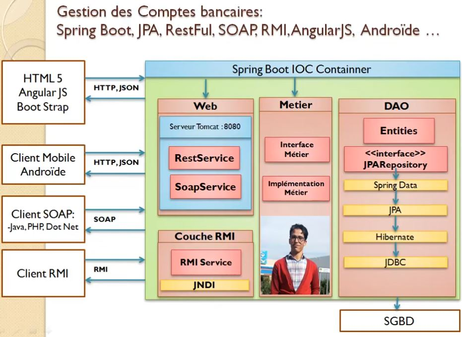
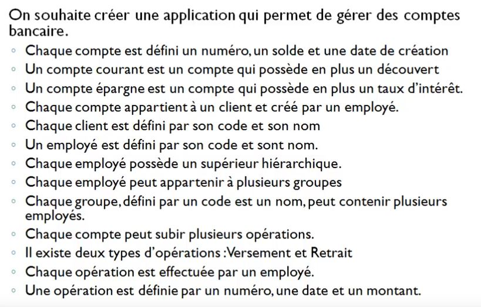
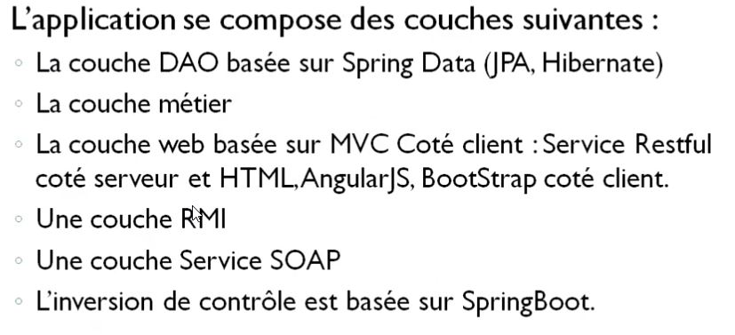
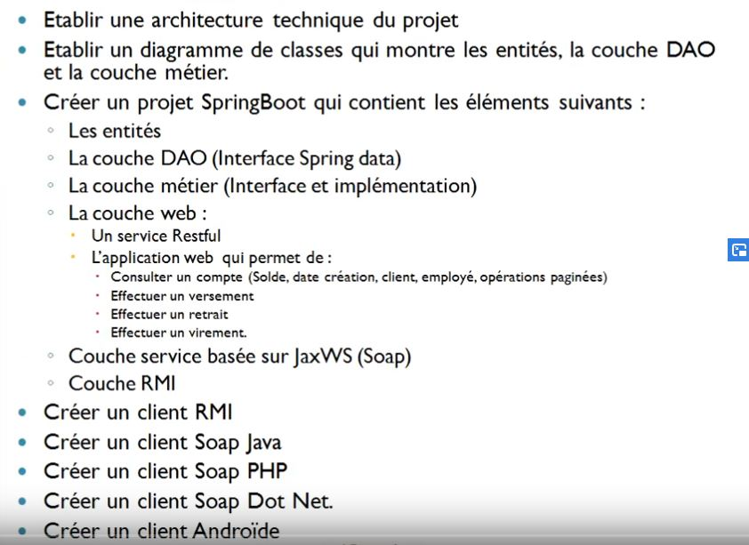
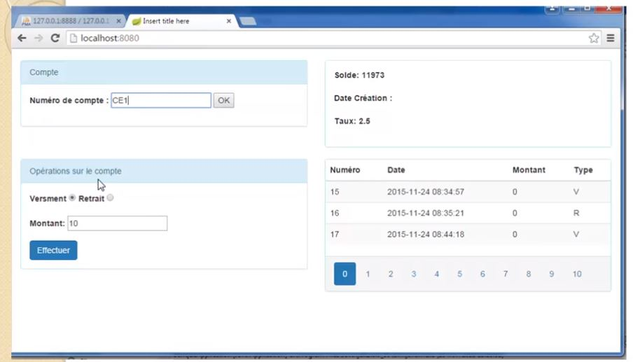

# Gestion Comptes Spring Boot JPA Hibernate Restful SOAP RMI AngularJS

[doc interessant](https://terasolunaorg.github.io/guideline/5.1.1.RELEASE/en/ArchitectureInDetail/SOAP.html)

[doc interessant](https://terasolunaorg.github.io/guideline/5.1.1.RELEASE/en/ArchitectureInDetail/REST.html)

https://www.youtube.com/watch?v=bmonVh9Bmtg&t=14s

## Arichitrecture J2EE

## Projet

**Spécification**

**Application**

**Travail à faire**

Projet web ( avant angular 4 )

**Diagrame de classe**

Il existe plusieurs stragétie pour mapper les classes d'heritage avec les tables au sein d'une base de données.  

La classe **Comptecourant** et **CompteEpargne** hérite de la classe **Compte**. On peut coté base de donnés ne creer qu'une table **Compte** avec une colonne additionnelle qui définis si c'est un **compteCourant** ou **compteEpargne**. Dans notre cas nous allons utiliser qu'une seule table avec cette attribut.

[ mise en oeuvre](doc/miseEnOeuvreServeur.md)

